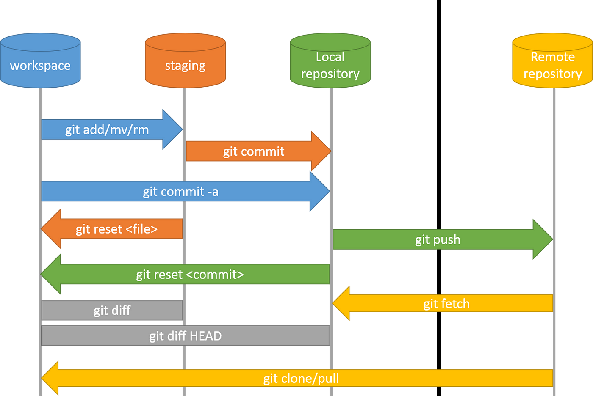

# ai-based-java-engineer

<!-- topic_000 -->

## git-github-usage

> It's just a tool for manage your works, documents, codes etc.

### Simple git commands for push your information to the remote repository

- `git add .`
  - This command help us to move our works to the `stagingArea` and these works are resting while waiting for the comment to be given to them, Example: `git add index.html`
- `git status`
  - This command every time answers your questions, about the git procsess for example: this command help you now that which files are tracked or which file are untracked
- `git commit -m "your comment"`
  - This command helps us to give some comments to the our works at remote repository, Example: `git commit -m "Today i'm not do eat something about gym`
- `git remote add origin ( remote repository link )`
  - This command help us to establish communication between LocalRepository & RemoteRepository
- `git branch -M main`
  - This command help us to change our brachName for example your local branch is a `master` but remote branch is `main` you need change local branch because local branch & remote branch's name should be the same
- `git push origin main`
  - This command helps you to push your works to the remote repository

<div style="width:100vw; heigth:200px; display: flex; justify-content: start; align-items: center; margin-top:3rem; ">
    
</div>

<!-- topic_002 -->

## variables

> In simply variables like a label'ed storage box'es in your territory, Each box have a

- name
- type
- value
- Key concepts
  - Declaration
    - `String employeeName`
    - `int employeeID`
  - Initilization
    - `employeeName = "Alex Johnson"`
    - `employeeID = 12345`
  - Declaration + Initialization
    - `String department = "Software development"`
  - ReAssignment
    - `salary = 75 000`
    - `salary = 80 000`

<!-- topic_003 -->

## data-types

> It's just a storage for collect your information's in storage

- Data types divided to

  - Primitive types

    - byte
    - short
    - int
    - long
    - float
    - double

  - Reference types
    - String
    - Classes
    - Arrays

- Type conversion - changing formats

  - Implicit conversion

    - `int number = 100`
    - `double decimal = number` // becomes 100.0 automaticly

  - Explicit conversion

    - `double salary = 234.999`
    - `int number = int (salary)` // become 234 automaticliy

<!-- topic_004 -->

## operators

| Operator | Name           | Description                      | Example |
| -------- | -------------- | -------------------------------- | ------- |
| +        | Addition       | Adds together two values         | x + y   |
| -        | Subtraction    | Subtracts one value from another | x - y   |
| \*       | Multiplication | Multiplies two values            | x \* y  |
| /        | Division       | Divides one value by another     | x / y   |
| %        | Modulus        | Returns the division remainder   | x % y   |
| ++       | Increment      | Increases the value by 1         | ++x     |
| --       | Decrement      | Decreases the value by 1         | --      |

<!-- topic_005 -->

## if-else-switch

- If & Else is the simplest way to make decisions in programming.

  - If the condition is true, the code block inside the `if` statement will be executed.
  - If the condition is false, the code block inside the `else` statement will be executed.

- Switch is used for more complex decision-making, not just yes/no situations. It can be used when there are more than two cases. Among the multiple `case`s defined, the code block inside the matching `case` will

<!-- topic_006 -->

## loops

- for

  - When perfectly we know, how many times we want to repeat something we can use `for`
  - Basic structure

  ```
  for (initialization; condition; update) {
  // Code to repeat
  }
  ```

- while

  - When you don't know, how many time you want to repeat something, but you need a condition for stop that
  - Basic structure

  ```
  while (condition) {
      // Code to repeat
  }
  ```

- do while

  - Like a while, but a bit diffeerent
  - Basic structure

  ```
  do {
      // Code to repeat
  } while (condition);

  ```

  <!-- topic_007 -->

## arrays

<!-- topic_008 -->

## object-oriented-programming

> In this document i need to touch & repeat all oop concepts

### 1. Introduction to OOP

- What is Object-Oriented Programming?

  > oop is a programming paradigm which is based on concepts of "Objects", which are instances of `classes`, allows you to structure your code like real-world models and i want to mention 4 main principles of oop: Encapsulation, Inheritance, Polymorphism, Abstraction

- Benefits of OOP

  > Modularity, Reusability, Scalability, Maintainability, Encapsulation, RealWorld modeling, Polymorphisim

- Real-life analogy

  > To understand OOP better, let's look at a real-world example — a Car, For example: Imagine a "Car": You can think of Car as a class, Each specific car you see (Toyota, BMW, etc.) is an object created from that class.

### 2. Core Concepts of OOP

- Class

  - Blueprint for creating objects

    > Blueprint is just a plan or template

  - Contains fields (variables) and methods (functions)

- Object

  - Instance of a class

    > it's just a plan, and object is a something created with class's plan

  - Represents a real-world entity

- Encapsulation

  > in simplfy think it is just pharmacy capsul encapsulated from the other things, and like this rule in program some data named like `private` so that they cannot be changed from anywhere

  - Binding data and methods together
  - Access modifiers: private, public, protected

    > private: can only be accessed from within the same class, public: can be accessed from anywhere, protected: can be accessed from the same package and subclasses

  - Getters and Setters

    > in these methods we can read private datas

    ```Java
    public class Student {
        private String name;

        public String getName() {
            return name;
        }

        public void setName(String newName) {
            name = newName;
        }
    }
    ```

- Abstraction

  - Hiding complex implementation details
  - Exposing only essential features
  - Abstract classes and Interfaces

- Inheritance

  - Acquiring properties and behaviors from another class
  - `extends` keyword
    > this keyword help us to extend parent class's behaviors
  - Superclass (parent) & Subclass (child)

    ```Java
        class Animal {
            void eat() {
                System.out.println("This animal eats food.");
            }
        }

        class Dog extends Animal {
            void bark() {
                System.out.println("The dog barks.");
            }
        }

        public class Main {
            public static void main(String[] args) {
                Dog myDog = new Dog();
                myDog.eat();  // Inherited from Animal
                myDog.bark(); // Defined in Dog
            }
        }
    ```

- Polymorphism

  > It means **"many forms"** — that is, the ability to use the same method in different ways.

  - Many forms: method overloading & overriding

    - Method overloading

      > Defining multiple methods with the same name but different parametrs in the same class and this known as compile time polymorphism

      ```Java
      class Math {
            int add(int a, int b) {
            return a + b;
            }

            int add(int a, int b, int c) {
            return a + b + c;
            }
        }

      ```

    - Method overriding

      > A subclass redefines a method defined in the superclass according to its own needs and it's known as runtime polymorphism

      ```Java
      class Animal {
          void makeSound() {
              System.out.println("Animal makes a sound.");
          }
      }

      class Cat extends Animal {
          void makeSound() {
              System.out.println("Cat meows.");
          }
      }
      ```

### 3. Advanced OOP Concepts

- Constructor and Overloaded Constructor

  - Constructor

    > it's a special methhod that is automaticly called when an object is created, it has name **same name as the class** and **does not have a return type** and it used to **initialize objects** with the default or initial values

    ```Java
    class Person {
    String name;
        // Constructor
        Person() {
            name = "Unknown";
        }
    }
    ```

  - Overloaded Constructor

    > Means that having more than one contructor in the same class with different parametrs, it allows objects to be initialized in multiple ways

    ```Java
      class Person {
          String name;
          int age;

          // Default constructor
          Person() {
              name = "Unknown";
              age = 0;
          }

          // Overloaded constructor
          Person(String name, int age) {
              this.name = name;
              this.age = age;
          }

      }

    ```

- What is the difference between `constructors` and `methods`?

  | Feature              | Constructor                                                                             | Method                                                   |
  | -------------------- | --------------------------------------------------------------------------------------- | -------------------------------------------------------- |
  | **Purpose**          | Used to create a new object                                                             | Used to define the behavior (functionality) of an object |
  | **Name**             | Must have the **same name as the class**                                                | Can have any name                                        |
  | **Return type**      | **No return type**, not even `void`                                                     | Must have a return type (`void`, `int`, `String`, etc.)  |
  | **How it is called** | Called automatically when a new object is created (with `new`)                          | Called manually: `object.methodName()`                   |
  | **Overloading**      | **Yes**, you can have multiple constructors with different parameters                   | Yes, methods can also be overloaded                      |
  | **Inheritance**      | Constructors are **not inherited**, but parent constructor can be called with `super()` | Methods **are inherited and can be overridden**          |

- this and super keywords

  - `this` keyword

    > refers to current object of class, it used also when you want to **Distinguish** between **class fields** and **method parameters** that have same name, can also be used to **call another constructor** in the same class

    ```Java
    class Student {
        String name;

        Student(String name) {
            this.name = name; // 'this.name' refers to the class variable
        }
    }
    ```

    ```Java
    class Student {
        String name;
        int age;

        Student() {
            this("Unknown", 0); // Calls the constructor below
        }

        Student(String name, int age) {
            this.name = name;
            this.age = age;
        }
    }

    ```

  - `super` keyword

    > refers to **parent (superclass)** of the current object, Used to acces superclass **methods or constructor** and helps to override methods properly and call parent class contructors

    ```Java
    class Animal {
      Animal() {
        System.out.println("Animal constructor called");
      }
    }

    class Dog extends Animal {
      Dog() {
        super(); // Calls the constructor of Animal
        System.out.println("Dog constructor called");
      }
    }

    ```

    ```Java
    class Animal {
    void makeSound() {
        System.out.println("Some sound");
      }
    }

    class Dog extends Animal {
      void makeSound() {
        super.makeSound(); // Calls the Animal class method
        System.out.println("Dog barks");
      }
    }
    ```

- Static members

  - Defines using the `static` keyword, Only **one copy** exists all objects of the class (shared), Accesed using the class name, not through an object

    ```Java
    class Counter {
      static int count = 0; // static member

      Counter() {
        count++; // count increase for the all objects
        System.out.println(count);
      }
    }

    public class Main {
      public static void main(String[] args) {
          Counter c1 = new Counter(); // 1
          Counter c2 = new Counter(); // 2
          Counter c3 = new Counter(); // 3
      }
    }

    ```

  Note: `static` keyword tips, Useful for storing shared data (like counters, configurations). Used in utility or helper methods (Math.random(), Collections.sort()).

- Final keyword

  | İstifadə         | Mənası                                            |
  | ---------------- | ------------------------------------------------- |
  | `final` variable | Dəyəri dəyişməz                                   |
  | `final` method   | Override edilə bilməz, ancaq overload edile biler |
  | `final` class    | Extend (miras) edilə bilməz                       |

<hr/>

> I will finsh the document after the tasks

<hr/>
- Composition vs Inheritance
- Aggregation

### 4. Access Modifiers

- public, private, protected, and default
- How they affect visibility

### 5. Interface vs Abstract Class

- Interface

  **In Java, an Interface** is a **template** that defines what functions a class should have. It only contains method signatures; **how these methods work is determined by the class that implements the interface**.

  > Simply put: `Interface` tells you "What you should do", but not "How you should do it".

  - Created using the `interface` keyword
  - A class can implement more than one interface
  - Provides 100% abstraction. For example, think about using a SmartPhone with various applications. You use these apps, but you don't care how they are made or how they work internally. In a way, this is like the "interface" for a human.

  ```Java
  interface Car {
      void startEngine();
      void accelerate();
      void brake();
  }

  class Sedan implements Car {

      public void startEngine() {
          System.out.println("Sedan engine started.");
      }

      public void accelerate() {
          System.out.println("Sedan is accelerating smoothly.");
      }

      public void brake() {
          System.out.println("Sedan is slowing down.");
      }
  }

  class SportCar implements Car {

      public void startEngine() {
          System.out.println("SportCar engine roars to life!");
      }

      public void accelerate() {
          System.out.println("SportCar accelerates like a rocket!");
      }

      public void brake() {
          System.out.println("SportCar brakes instantly.");
      }
  }

  public class Main {
      public static void main(String[] args) {
          Car mySedan = new Sedan();
          Car mySportCar = new SportCar();

          System.out.println("--- Sedan ---");
          mySedan.startEngine();
          mySedan.accelerate();git
          mySedan.brake();

          System.out.println("\n--- SportCar ---");
          mySportCar.startEngine();
          mySportCar.accelerate();
          mySportCar.brake();
      }
  }
  ```

- Abstract Class

- Differences and use cases
- When to use which?

### 6. Real-world OOP Example

- Mini project or code snippet demonstrating OOP in action

### 7. OOP Best Practices

- SOLID Principles (Single Responsibility, Open/Closed, etc.)
- DRY (Don't Repeat Yourself)
- Reusability
- Maintainability
